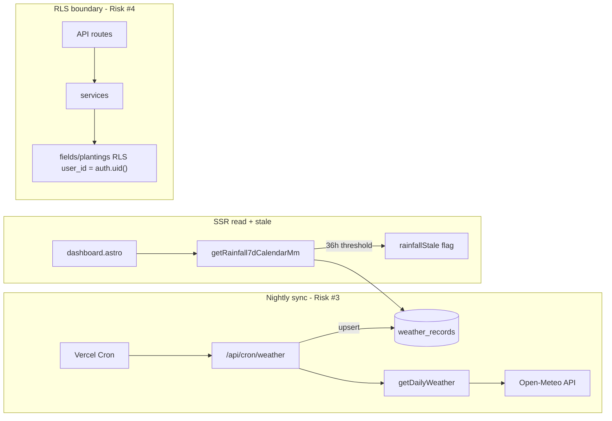

# Research: Phase 2 integration tests — weather sync and RLS data boundaries

**Date**: 2026-06-23  
**Researcher**: Auto  
**Git Commit**: `ee49e28a6abcfb02112b3c28e66355f8ac0c4aaa`  
**Branch**: `development`  
**Repository**: `my-garden`

## Research Question

What must Phase 2 integration tests cover for Risks #3 (weather sync breaks silently) and #4 (IDOR on field/planting data), and where in the codebase do those failures actually live?

Grounding requirements from `context/foundation/test-plan.md` and `context/archive/2026-06-23-testing-integration-hotspots/change.md`:

- **Risk #3**: prove weather fetch returns expected fields, stale data is flagged, failed fetch does not corrupt existing records; challenge that HTTP 200 means correct data was stored; avoid over-mocking the external API.
- **Risk #4**: prove User A cannot read or modify User B's `fields`/`plantings`; use real cookie/session shape; test with Supabase local, not handler mocks alone.

## Summary

Phase 1 established Vitest with **mocked** handler integration (`src/test/api/`) and explicitly deferred live Supabase/RLS work. Phase 3 added **Postgres seed smoke** (`db:smoke`) — schema/seed integrity only, not behavioral RLS or weather sync. **Phase 2 has no live integration infrastructure yet.**

**Risk #3** concentrates in the nightly cron path: `GET /api/cron/weather` → `getDailyWeather` → upsert into `weather_records`. Silent-failure vectors include swallowed exceptions, always-HTTP-200 responses, and empty Open-Meteo parses that skip upsert without incrementing `failed`. Stale rainfall is flagged at 36h via `isRainfallStale` in `getRainfall7dCalendarMm`, consumed by dashboard SSR. Open-Meteo parsing (`src/lib/services/open-meteo.ts`) has **zero direct tests**; cron tests mock `getDailyWeather` entirely.

**Risk #4** is enforced primarily by **RLS** (`user_id = auth.uid()`) on `fields` and `plantings`. App-level 403 exists only on PATCH/DELETE `/api/plantings/[id]`. Reads and POST plantings rely on RLS alone — with a documented gap: `plantings` INSERT does not verify `field_id` belongs to the caller. No Vitest test exercises live RLS; Playwright auth setup provisions a single user via service role.

**Phase 2 must add**: Open-Meteo response fixtures, live `weather_records` round-trip tests, shared Supabase test helpers (two-user sessions), and a Vitest path that uses real local env keys (not `astro-virtual.ts` mocks).

## Detailed Findings

### Risk #3 — Weather sync architecture

#### Entry points

| Layer | File | Role |
|-------|------|------|
| Nightly cron | [`src/pages/api/cron/weather.ts`](https://github.com/Lovable-wojkos/my-garden/blob/ee49e28a6abcfb02112b3c28e66355f8ac0c4aaa/src/pages/api/cron/weather.ts) | Auth via `Bearer ${CRON_SECRET}`; loops regions; upserts `weather_records` |
| Cron schedule | [`vercel.json`](https://github.com/Lovable-wojkos/my-garden/blob/ee49e28a6abcfb02112b3c28e66355f8ac0c4aaa/vercel.json) | `0 0 * * *` → `/api/cron/weather` |
| Live widget API | [`src/pages/api/weather.ts`](https://github.com/Lovable-wojkos/my-garden/blob/ee49e28a6abcfb02112b3c28e66355f8ac0c4aaa/src/pages/api/weather.ts) | Authenticated GET; calls `getWeather`; never writes DB |
| Open-Meteo service | [`src/lib/services/open-meteo.ts`](https://github.com/Lovable-wojkos/my-garden/blob/ee49e28a6abcfb02112b3c28e66355f8ac0c4aaa/src/lib/services/open-meteo.ts) | `geocodeCity`, `getWeather`, `getAutoTimezone`, `getDailyWeather` |
| DB read + stale | [`src/lib/services/weather.ts`](https://github.com/Lovable-wojkos/my-garden/blob/ee49e28a6abcfb02112b3c28e66355f8ac0c4aaa/src/lib/services/weather.ts) | `getRainfall7dCalendarMm`, `isRainfallStale` (36h threshold) |
| Display fallback | [`src/lib/weather-display.ts`](https://github.com/Lovable-wojkos/my-garden/blob/ee49e28a6abcfb02112b3c28e66355f8ac0c4aaa/src/lib/weather-display.ts) | `displayRainfall7dMm(fromDb, fromLiveApi)` |
| SSR consumers | [`src/pages/dashboard.astro`](https://github.com/Lovable-wojkos/my-garden/blob/ee49e28a6abcfb02112b3c28e66355f8ac0c4aaa/src/pages/dashboard.astro), [`src/pages/dashboard/fields/[id].astro`](https://github.com/Lovable-wojkos/my-garden/blob/ee49e28a6abcfb02112b3c28e66355f8ac0c4aaa/src/pages/dashboard/fields/%5Bid%5D.astro) | Pass `rainfallStale` to `WeatherWidget` |

#### `weather_records` schema

- Initial table: [`supabase/migrations/20260525000000_initial_schema.sql`](https://github.com/Lovable-wojkos/my-garden/blob/ee49e28a6abcfb02112b3c28e66355f8ac0c4aaa/supabase/migrations/20260525000000_initial_schema.sql) — `region_id`, `recorded_at`, `temperature_c`, `rainfall_mm`; RLS SELECT-only for authenticated; cron uses service role.
- Coords extension: [`supabase/migrations/20260601000000_add_coords_to_weather_records.sql`](https://github.com/Lovable-wojkos/my-garden/blob/ee49e28a6abcfb02112b3c28e66355f8ac0c4aaa/supabase/migrations/20260601000000_add_coords_to_weather_records.sql) — nullable `region_id`, adds `latitude`/`longitude`.
- Unique index: `(region_id, recorded_at)` — upsert conflict key in cron.

Cron upsert maps Open-Meteo calendar dates to `recorded_at: ${date}T00:00:00Z` and upserts on `(region_id, recorded_at)`.

#### Stale data flagging

Two mechanisms:

1. **DB-backed (36h)**: `RAINFALL_STALE_MS` and `isRainfallStale` in `weather.ts`; `getRainfall7dCalendarMm` returns `rainfallStale: true` when latest record is older than 36h or window incomplete (< 7 distinct dates). Dashboard passes `null` DB rainfall when stale (`dashboard.astro` line 55).
2. **Widget live fetch**: `WeatherWidget.tsx` sets `stale: true` on fetch failure when prior data exists; badge when `weatherState.stale || rainfallStale`.

#### Failure behavior — does fetch failure corrupt records?

| Scenario | Behavior | Corrupts DB? |
|----------|----------|--------------|
| `getDailyWeather` throws | `catch` → `failed++`; no upsert | **No** |
| Upsert error | `failed++` | **No** |
| `getDailyWeather` returns `[]` (missing `daily.time`) | Skips upsert; **neither `fetched` nor `failed` incremented** | **No**, but **silent** |
| Partial region failure | Other regions still upsert | Per-region isolation |
| HTTP response | Always **200** with `{ fetched, failed, locations, backfilled }` | Cron never returns non-2xx on per-region failure |

**Risk #3 silent-failure hotspots** in cron (`weather.ts` lines 48–61):

- Empty parse → no `failed++`, no logging
- Swallowed `catch (_e)` — no error detail
- HTTP 200 even when all regions fail

#### Existing weather tests

| File | Coverage | Gap |
|------|----------|-----|
| `src/test/lib/weather-rainfall-calendar.test.ts` | Pure calendar/stale helpers | No Open-Meteo |
| `src/test/lib/weather-rainfall-region.test.ts` | `getRainfall7dCalendarMm` with mocked Supabase | No live DB |
| `src/test/lib/weather-display.test.ts` | `displayRainfall7dMm` | — |
| `src/test/api/cron-weather.test.ts` | Cron auth, happy-path upsert payload | Mocks `getDailyWeather`; no failure paths, no DB round-trip |

**No Open-Meteo JSON fixtures exist.** MSW is listed in test-plan §4 but not in `package.json` dependencies.

### Risk #4 — RLS and IDOR architecture

#### RLS policies

**`fields`** and **`plantings`** — owner-scoped CRUD in [`supabase/migrations/20260525000000_initial_schema.sql`](https://github.com/Lovable-wojkos/my-garden/blob/ee49e28a6abcfb02112b3c28e66355f8ac0c4aaa/supabase/migrations/20260525000000_initial_schema.sql):

- SELECT/INSERT/UPDATE/DELETE: `user_id = auth.uid()`
- UPDATE hardened with `WITH CHECK` in [`supabase/migrations/20260526200000_merge_rls_admin_and_fk_indexes.sql`](https://github.com/Lovable-wojkos/my-garden/blob/ee49e28a6abcfb02112b3c28e66355f8ac0c4aaa/supabase/migrations/20260526200000_merge_rls_admin_and_fk_indexes.sql) — blocks ownership transfer

**Documented policy gap**: `plantings` INSERT checks `planting.user_id = auth.uid()` but **not** `fields.user_id = auth.uid()`. User A could theoretically insert a planting on User B's field if the INSERT succeeds at the DB layer.

#### Ownership enforcement layers

```
Request → middleware (PROTECTED_ROUTES redirect) → handler (401/403) → service → RLS
```

| Route | Middleware | Handler ownership | RLS |
|-------|------------|-------------------|-----|
| `POST /api/fields` | **Not** protected | Sets `user_id` from session | Backstop |
| `GET/POST /api/plantings` | Protected | No field ownership check on POST | Backstop |
| `PATCH/DELETE /api/plantings/[id]` | Protected | **403** if `existing.user_id !== user.id` | Backstop |
| `GET /api/plantings?field_id=` | Protected | No app check; delegates to service | Backstop |
| `/dashboard/fields/[id]` SSR | Protected | No explicit check; `getFieldById` + RLS | Backstop |

Field detail on RLS miss throws 500 (`[id].astro` lines 41–43), not 403/404.

#### Existing auth/IDOR tests (mocked only)

- `src/test/middleware.test.ts` — redirect matrix, no cross-user
- `src/test/api/fields-index.test.ts` — 401 unauthenticated; documents dual auth semantics
- `src/test/api/plantings-index.test.ts` — 401, happy-path GET with mocks
- `src/test/api/plantings-id.test.ts` — **403** when mocked planting has `user_id: "other-user"`; proves handler logic, not RLS

### Test infrastructure — what exists vs. what Phase 2 needs

#### Phase 1 patterns (keep)

- Vitest config: `vitest.config.ts` — `happy-dom`, `@/` alias, `astro:env/server` → `src/test/mocks/astro-virtual.ts`
- Mocked handler tests under `src/test/api/`
- `makeQueryBuilder` / `makeClient` in `src/test/lib/plants.test.ts`
- Fixtures: `EXPECTED_CATALOG`, `EXPECTED_REGIONS`

#### Phase 3 patterns (adjacent, not substitutable)

- `npm run db:smoke` — raw `pg` to `127.0.0.1:54322`; seed/schema integrity only; **bypasses RLS**
- `npm run db:verify` — `db:reset` + `db:smoke`

#### Gaps Phase 2 must fill

| Gap | Detail |
|-----|--------|
| No Supabase test helpers | No `src/test/helpers/` or `createTestClient` |
| Vitest env mock blocks live DB | `astro-virtual.ts` fake keys — integration needs real `.env` or separate vitest project |
| No two-user session setup | Playwright `auth.setup.ts` creates one admin user only |
| No Open-Meteo fixtures | Planned in test-plan; not on disk |
| CI has no Supabase | Deferred to Phase 4 |

**Closest live-DB precedent**: Playwright service-role provisioning in [`playwright/auth/auth.setup.ts`](https://github.com/Lovable-wojkos/my-garden/blob/ee49e28a6abcfb02112b3c28e66355f8ac0c4aaa/playwright/auth/auth.setup.ts) and cleanup in `playwright/tests/admin-plant-requests.spec.ts`.

## Code References

- `src/pages/api/cron/weather.ts:34-61` — per-region fetch/upsert loop; swallowed errors; silent empty-response skip
- `src/lib/services/open-meteo.ts:150-187` — `getDailyWeather` parsing; returns `[]` on missing `daily.time`
- `src/lib/services/weather.ts:83-142` — `RAINFALL_STALE_MS`, `isRainfallStale`
- `src/lib/services/weather.ts:154-224` — `getRainfall7dCalendarMm` stale + incomplete window
- `src/pages/dashboard.astro:38-55` — SSR rainfall gating when stale
- `supabase/migrations/20260525000000_initial_schema.sql:100-171` — fields/plantings RLS
- `supabase/migrations/20260526200000_merge_rls_admin_and_fk_indexes.sql:23-39` — UPDATE WITH CHECK hardening
- `src/pages/api/plantings/[id].ts:68-73` — handler 403 on ownership mismatch
- `src/middleware.ts:6-15` — `PROTECTED_ROUTES` (includes `/api/plantings`, not `/api/fields`)
- `src/test/api/cron-weather.test.ts:8-9` — mocks block live weather sync proof
- `vitest.config.ts:12-13` — `astro:env/server` mock alias
- `scripts/db-smoke.mjs:11` — Postgres URL for local stack

## Architecture Insights



1. **Weather has two paths**: live widget (`/api/weather`, no DB write) vs. nightly sync (cron → `weather_records`). Risk #3 proof targets the sync path and the stale read path.
2. **RLS is the authoritative backstop** for field/planting reads; handler 403 is defense-in-depth on PATCH/DELETE only.
3. **Phase 1 mocked tests and Phase 2 live tests are complementary** — keep handler mocks; add live tests alongside.
4. **Test-plan anti-patterns to respect**: over-mocking Open-Meteo (use recorded fixtures); over-mocking auth (use real sessions for RLS).

## Historical Context (from prior changes)

- [`context/archive/2026-06-15-testing-critical-path-coverage/plan-brief.md`](context/archive/2026-06-15-testing-critical-path-coverage/plan-brief.md) — deferred MSW and live RLS to Phase 2; `vi.mock` sufficient for Phase 1.
- [`context/archive/2026-06-15-testing-critical-path-coverage/research.md`](context/archive/2026-06-15-testing-critical-path-coverage/research.md) — identified two-layer auth and RLS as silent backstop behind mocked handler tests.
- [`context/archive/2026-06-17-testing-data-integrity/plan.md`](context/archive/2026-06-17-testing-data-integrity/plan.md) — explicitly scoped out live RLS/IDOR (Phase 2) and CI Supabase (Phase 4).
- [`context/foundation/test-plan.md`](context/foundation/test-plan.md) §3 Phase 2, §6.2 — live Supabase integration deferred until this change.

## Recommended Integration Test Scenarios

### Risk #3 — priority order

| # | Scenario | Touch points |
|---|----------|--------------|
| 1 | `getDailyWeather` parses recorded Open-Meteo fixture (past-only days, excludes today) | `open-meteo.ts`, new `src/test/fixtures/open-meteo/` |
| 2 | Cron upsert writes expected rows; re-run updates on conflict | `cron/weather.ts`, live `weather_records` |
| 3 | `getDailyWeather` throw → `failed++`, **pre-seeded rows unchanged** | `cron/weather.ts` |
| 4 | Empty/malformed Open-Meteo response → document silent skip (no `failed++`) | `open-meteo.ts:173`, `cron/weather.ts:48-58` |
| 5 | `getRainfall7dCalendarMm` with 7 seeded days → `rainfallStale: false`; old `latestRecordedAt` → stale | `weather.ts`, live DB |
| 6 | Cron HTTP 200 when all regions fail — assert body `failed` count, not status alone | `cron/weather.ts:64-71` |

### Risk #4 — priority order

| # | Actor | Action | Expected |
|---|-------|--------|----------|
| 1 | User A | SELECT User B's field by id | Empty / PGRST116 |
| 2 | User A | SELECT plantings for B's field | `[]` |
| 3 | User A | UPDATE/DELETE B's field or planting | 0 rows |
| 4 | User A | GET `/api/plantings?field_id=<B>` | 200 + `[]` |
| 5 | User A | PATCH/DELETE B's planting id | 404 (RLS hides) or 403 |
| 6 | User A | INSERT planting with `field_id=B`, `user_id=A` | **Assert actual behavior** — documents policy gap |
| 7 | User A | UPDATE own field with `user_id=B` | Blocked by WITH CHECK |

### Infrastructure to implement

1. **`src/test/integration/helpers/supabase.ts`** — service-role user creation, `signInWithPassword` or `verifyOtp` sessions, teardown; pattern from Playwright auth setup.
2. **`src/test/fixtures/open-meteo/`** — recorded forecast JSON for Warsaw coords (`52.229676, 21.012229`).
3. **Vitest project split or env override** — integration files use real `SUPABASE_*` from `.env`; unit tests keep `astro-virtual.ts` mock.
4. **Optional**: `test:integration` npm script gated on `supabase status` or `DATABASE_URL` presence; local-only (CI in Phase 4).

## Related Research

- [`context/archive/2026-06-15-testing-critical-path-coverage/research.md`](context/archive/2026-06-15-testing-critical-path-coverage/research.md) — auth layers, RLS deferral
- [`context/archive/2026-06-17-testing-data-integrity/research.md`](context/archive/2026-06-17-testing-data-integrity/research.md) — db smoke patterns

## Open Questions

1. **Vitest config strategy**: separate `vitest.integration.config.ts` vs. conditional env in shared config — needs decision in plan phase.
2. **POST planting on another user's field**: is current RLS behavior a bug to fix or accepted risk to document-only?
3. **Field detail SSR on RLS miss**: should tests assert 500 today or drive a 404/redirect fix?
4. **MSW vs. `vi.stubGlobal('fetch')`**: test-plan lists MSW; Phase 1 deferred it — fixture + fetch stub may suffice for Open-Meteo without adding MSW dependency.
5. **Cron integration scope**: test handler with real service-role client + stubbed `fetch`, or full HTTP — trade-off between fidelity and setup cost.
